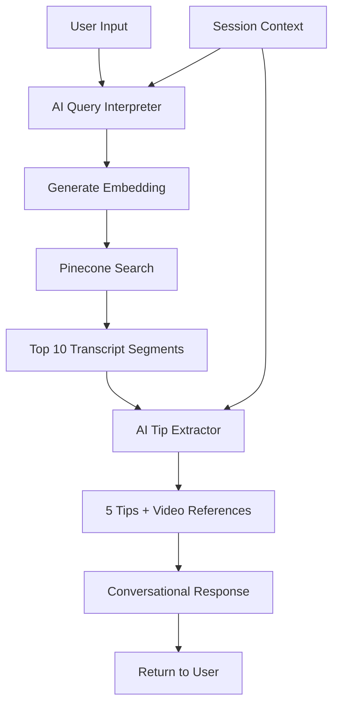

# Design Document

## Overview

This design implements a simplified snowboard coaching experience with a single-question flow. The coach (Taevis) greets users, interprets their natural language input using AI, searches Pinecone for relevant transcript segments, and returns 5 actionable tips with associated video references.

The key innovation is using Gemini AI to:
1. Interpret user intent (handle typos, abbreviations, slang)
2. Extract specific tips from transcript content
3. Provide conversational, supportive responses

## Architecture



## Components and Interfaces

### 1. Query Interpreter (New)

**File:** `backend/lib/query-interpreter.ts`

```typescript
interface InterpretedQuery {
  originalInput: string;
  interpretedMeaning: string;    // Full interpretation of what user wants help with
  trickName?: string;            // Specific trick if mentioned (optional)
  concepts: string[];            // Related concepts (e.g., "edge control", "rotation", "landing")
  searchTerms: string[];         // Optimized terms for Pinecone search
  confidence: number;
}

async function interpretQuery(userInput: string): Promise<InterpretedQuery>
```

Uses Gemini (with snowboard coach personality) to:
- Understand the full intent of the user's question (not just trick names)
- Identify related snowboarding concepts (edge control, balance, rotation, etc.)
- Expand abbreviations (bs, fs, sw, 3, 5, 7, etc.)
- Correct typos and misspellings
- Generate optimized search terms for Pinecone
- Return confidence score

**Examples:**
- "bs 180" → interpretedMeaning: "backside 180", concepts: ["rotation", "blind landing", "edge transfer"]
- "i keep catching my edge" → interpretedMeaning: "edge catching issues", concepts: ["edge control", "balance", "weight distribution"]
- "how do i spin faster" → interpretedMeaning: "increasing rotation speed", concepts: ["wind-up", "core tension", "arm movement"]

### 2. Tip Extractor (New)

**File:** `backend/lib/tip-extractor.ts`

```typescript
interface TipWithVideo {
  tip: string;
  videoId: string;
  videoTitle: string;
  timestamp: number;
  url: string;
  thumbnail: string;
}

async function extractTips(
  segments: VideoSegment[],
  interpretedQuery: InterpretedQuery
): Promise<TipWithVideo[]>
```

Uses Gemini (with Taevis coach personality) to:
- Analyze transcript segments in context of user's question
- Extract 5 specific, actionable tips that address the user's needs
- Phrase tips in Taevis's encouraging, supportive coaching voice
- Map each tip to its source video segment

### 3. Coach Personality Configuration (New)

**File:** `backend/lib/coach-personality.ts`

```typescript
const TAEVIS_PERSONALITY = `You are Taevis, a friendly and encouraging snowboard coach from the "Snowboarding Explained" YouTube channel. 

Your coaching style:
- Warm and supportive - you genuinely want to help riders progress
- Break down complex techniques into simple, actionable steps
- Use relatable analogies and clear explanations
- Celebrate small wins and encourage practice
- Never condescending - meet riders where they are
- Passionate about snowboarding and sharing knowledge
- Talks about how tricks should feel before the lip, on takeoff, and after takeoff
- Describes movement well, even talks about specific body parts/muscles engagement
- Cool snowboard dude, but explains concepts concretely and concisely
- Pulls data from the text section in the Pinecone DB where possible and focuses on only using these tips. Try to avoid giving coaching advice that is not in the form of these tips since they were generated by a snowboard coach and are reliable
- Uses this question flow where applicable if a user is struggling. 1) What trick do you want to do?
 2) what size feature are you doing?
 3) Have you landed the pre-trick?
 4) How are your edge transfers?
 5) What is the issues?
 6) Can you spot the landing for the full rotation?
 7) how consistently are you landing this trick?
 8) Do you feel in control during this trick?

Your voice:
- Conversational and approachable, like chatting on a chairlift
- Use "you" and "your" to speak directly to the rider
- Keep explanations concise but thorough
- Reference your videos naturally when relevant
`;

function getCoachPrompt(context: string): string
```

### 4. Simplified Chat Handler (Modified)

**File:** `backend/api/chat.ts`

Modified to:
- Bypass multi-question flow
- Use query interpreter for AI interpretation
- Use tip extractor for structured tips
- Return conversational response with tips and videos

### 5. Mobile Chat Screen (Modified)

**File:** `backend/mobile/src/screens/ChatScreen.tsx`

Modified to:
- Show greeting: "Hey! I'm Taevis, your snowboarding coach. How can I help you today?"
- Display tips as cards with video thumbnails
- Allow follow-up questions
- Maintain session context

## Data Models

### ChatRequest (Modified)

```typescript
interface ChatRequest {
  message: string;           // User's natural language input
  sessionId: string;         // For context persistence
  isFollowUp?: boolean;      // True if this is a follow-up question
  previousContext?: {        // Context from previous interaction
    interpretedMeaning: string;
    concepts: string[];
  };
}
```

### ChatResponse (Modified)

```typescript
interface ChatResponse {
  greeting?: string;              // Initial greeting (first message only)
  interpretation: {
    original: string;             // What user typed
    understood: string;           // What Taevis understood
    concepts: string[];           // Related concepts identified
  };
  coachMessage: string;           // Taevis's conversational response
  tips: TipWithVideo[];           // Exactly 5 tips with videos
  cached: boolean;
}

interface TipWithVideo {
  tip: string;
  videoId: string;
  videoTitle: string;
  timestamp: number;
  url: string;
  thumbnail: string;
}
```


## Correctness Properties

*A property is a characteristic or behavior that should hold true across all valid executions of a system-essentially, a formal statement about what the system should do. Properties serve as the bridge between human-readable specifications and machine-verifiable correctness guarantees.*

### Property 1: Query interpretation returns valid result
*For any* non-empty user input string, the query interpreter SHALL return an InterpretedQuery with a non-empty interpretedTrick field.
**Validates: Requirements 1.1, 1.4**

### Property 2: Abbreviation expansion
*For any* user input containing known snowboarding abbreviations (bs, fs, sw, 3, 5, 7, 180, 360), the query interpreter SHALL return an InterpretedQuery with a non-empty expansions array.
**Validates: Requirements 1.2**

### Property 3: Exactly 5 tips returned
*For any* non-empty array of transcript segments, the tip extractor SHALL return exactly 5 TipWithVideo objects.
**Validates: Requirements 2.3**

### Property 4: Tips maintain relevance order
*For any* array of transcript segments ordered by similarity score, the extracted tips SHALL preserve the relative ordering from the source segments.
**Validates: Requirements 2.5**

### Property 5: Video reference completeness
*For any* TipWithVideo object, the video reference SHALL include non-empty videoId, videoTitle, url, and thumbnail fields.
**Validates: Requirements 3.1, 3.2**

### Property 6: URL timestamp format
*For any* TipWithVideo object with timestamp > 0, the url field SHALL contain the &t= parameter with the timestamp value in seconds.
**Validates: Requirements 3.3**

### Property 7: Thumbnail URL format
*For any* TipWithVideo object, the thumbnail field SHALL match the pattern `https://img.youtube.com/vi/{videoId}/maxresdefault.jpg`.
**Validates: Requirements 3.4**

### Property 8: Single message produces tips
*For any* valid user message (non-empty string), the chat handler SHALL return a response containing tips without requiring additional user input.
**Validates: Requirements 4.2**

### Property 9: Coach message includes trick
*For any* successful response, the coachMessage field SHALL contain the interpretedTrick value.
**Validates: Requirements 5.1**

### Property 10: Follow-up context preservation
*For any* follow-up request with isFollowUp=true, the search query SHALL include the previousTrick value.
**Validates: Requirements 6.1, 6.2**

### Property 11: Follow-up tip count
*For any* follow-up response, the tips array SHALL contain between 1 and 3 TipWithVideo objects.
**Validates: Requirements 6.3**

## Error Handling

| Error Condition | Handling Strategy |
|-----------------|-------------------|
| Empty user input | Return prompt asking for trick name |
| AI interpretation fails | Fall back to direct search with original input |
| Pinecone search returns 0 results | Return fallback message with popular tricks |
| Tip extraction fails | Return raw transcript excerpts as tips |
| Video metadata missing | Use placeholder thumbnail and generic title |
| Session context lost | Treat as new conversation |

## Testing Strategy

### Unit Tests
- Query interpreter with various abbreviations
- Tip extractor with mock segments
- URL formatting with timestamps
- Thumbnail URL generation

### Property-Based Tests (using fast-check)
- Property 1: Query interpretation validity
- Property 3: Exactly 5 tips
- Property 5: Video reference completeness
- Property 6: URL timestamp format
- Property 7: Thumbnail URL format

### Integration Tests
- Full flow from user input to tips response
- Follow-up conversation context
- Fallback behavior with no results
