# Snowboarding Ontology Graph

## Core Concepts and Relationships

## Problem Categories and Solutions

```mermaid
graph LR
    A["LANDING PROBLEMS"]
    
    A --> B["FALLING FORWARD<br/>Weight too far forward"]
    A --> C["FALLING BACKWARD<br/>Weight too far back"]
    A --> D["CATCHING EDGE<br/>Edge too sharp"]
    A --> E["SLIDING OUT<br/>Edge too light"]
    
    B --> B1["❌ Not enough pop<br/>❌ Over-rotating"]
    B --> B2["✅ Shift weight back<br/>✅ Increase pop"]
    
    C --> C1["❌ Under-rotating<br/>❌ Late pop"]
    C --> C2["✅ Complete rotation<br/>✅ Pop earlier"]
    
    D --> D1["❌ Board twisted<br/>❌ Uneven weight"]
    D --> D2["✅ Align board<br/>✅ Distribute weight"]
    
    E --> E1["❌ Not enough grip<br/>❌ Flat base landing"]
    E --> E2["✅ Increase pressure<br/>✅ Engage edge"]
    
    style A fill:#ff6b6b
    style B fill:#ffa502
    style C fill:#ffa502
    style D fill:#ffa502
    style E fill:#ffa502
    style B2 fill:#26de81
    style C2 fill:#26de81
    style D2 fill:#26de81
    style E2 fill:#26de81
```

## Concept Dependencies

## Trick Categories Hierarchy

## Domain Concept Map

```mermaid
graph TB
    subgraph Fundamentals["🏂 FUNDAMENTALS"]
        Pop["POP"]
        Edge["EDGE CONTROL"]
        Body["BODY POSITION"]
        Commit["COMMITMENT"]
    end
    
    subgraph Techniques["🎯 TECHNIQUES"]
        Rotation["ROTATION"]
        Landing["LANDING"]
        Blind["BLIND LANDING"]
        Switch["SWITCH RIDING"]
        Grab["GRAB"]
    end
    
    subgraph Problems["⚠️ PROBLEMS"]
        FallFwd["Falling Forward"]
        FallBck["Falling Backward"]
        CatchEdge["Catching Edge"]
        SlideOut["Sliding Out"]
        UnderRot["Under-rotating"]
        OverRot["Over-rotating"]
    end
    
    subgraph Tricks["🎪 TRICKS"]
        Spins["Spins<br/>180-1080°"]
        Rails["Rails<br/>Boardslide, 50-50"]
        Grabs["Grabs<br/>Indy, Melon, etc"]
    end
    
    Pop --> Rotation
    Edge --> Landing
    Body --> Landing
    Commit --> Blind
    
    Rotation --> Spins
    Landing --> Tricks
    Blind --> Tricks
    Switch --> Tricks
    Grab --> Tricks
    
    Landing --> FallFwd
    Landing --> FallBck
    Edge --> CatchEdge
    Edge --> SlideOut
    Rotation --> UnderRot
    Rotation --> OverRot
    
    style Pop fill:#4ecdc4
    style Edge fill:#4ecdc4
    style Body fill:#4ecdc4
    style Commit fill:#4ecdc4
    style Rotation fill:#45b7d1
    style Landing fill:#45b7d1
    style Blind fill:#f9ca24
    style Switch fill:#6c5ce7
    style Grab fill:#a29bfe
    style FallFwd fill:#ff6b6b
    style FallBck fill:#ff6b6b
    style CatchEdge fill:#ff6b6b
    style SlideOut fill:#ff6b6b
    style UnderRot fill:#ff6b6b
    style OverRot fill:#ff6b6b
    style Spins fill:#26de81
    style Rails fill:#26de81
    style Grabs fill:#26de81
```

## How Domain Classification Works

## Key Insights

### Before (Semantic Search Only)
- Search all 1166 records
- Get mixed results (landing tips + BS720 tips + rotation tips)
- Gemini has to synthesize from noisy data
- Slow and expensive

### After (Domain-Aware Hybrid)
- Classify question using ontology
- Filter Pinecone by: trick + problem + concepts
- Search ~50 relevant records
- Gemini synthesizes from clean, focused data
- Fast, cheap, and accurate

### The Semantic Gap Bridge
- **General LLM**: "landing" = any contact with ground
- **Snowboarding**: "landing" = specific technique with body position, edge control, commitment
- **Ontology**: Defines snowboarding-specific meaning
- **Classifier**: Uses ontology to extract true intent
- **Result**: LLM now understands snowboarding context
